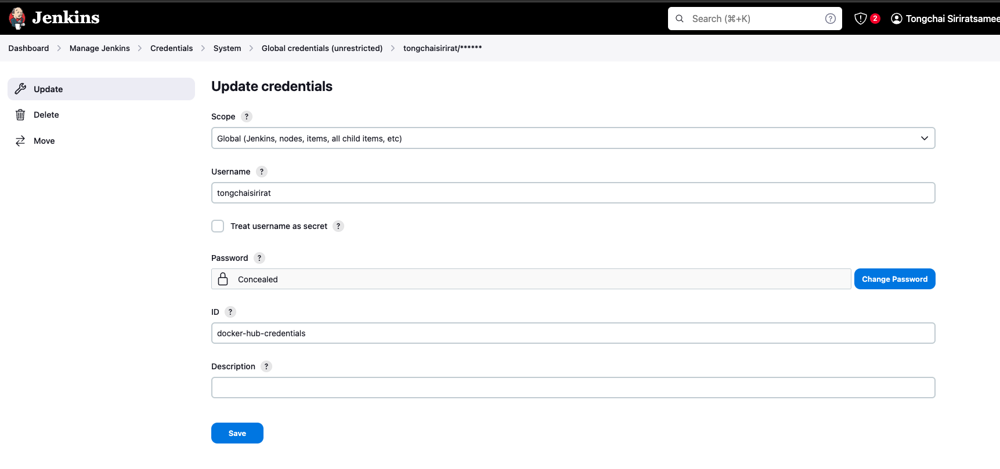

https://tutorials.releaseworksacademy.com/learn/building-your-first-docker-image-with-jenkins-2-guide-for-developers

## 1.สร้าง github repo และสร้างไฟล์ dockerfile และ jenkinsfile
https://github.com/tongchaisirirat/httpd

## 2.Docker hub สร้าง repo
https://hub.docker.com/repository/docker/tongchaisirirat/httpd/general
# create token access
https://hub.docker.com/settings/security

## 3.jenkins local host 
# สร้าง pipline SCM

# สร้าง credencial ที่ได้จาก dockerhub
Docker hub
ACCESS TOKEN DESCRIPTION
ID: docker-hub-credentials
dockerhub

docker login  -u tongchaisirirat
password : -------------
